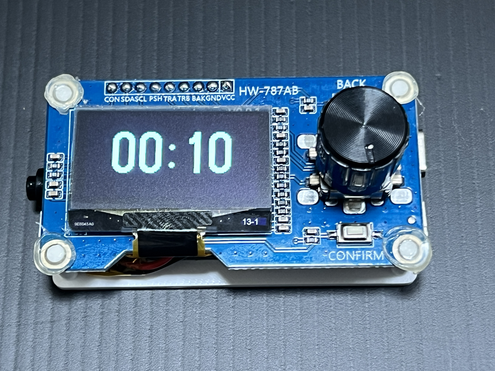

# ESP32-Screen-Project

This project showcases a simple yet effective Pomodoro timer built with an ESP32 and an integrated 1.3 OLED display with knob and buttons. It can be used for more interesting projects as well

## 🧰 Hardware Components
- A 1.3-inch SH1106 OLED display connected via I2C (SDA=GPIO19, SCL=GPIO23)
- An EC11 rotary encoder (A=GPIO5, B=GPIO17, Push=GPIO18)
- A Confirm button on GPIO22 (functions the same as the rotary push button)
- A Back button on GPIO16 (used to exit countdown and return to main menu)
- Picture of the complete set. More pictures will be released soon.

---

| OLED Pin | GPIO | Remark        |
|----------|------|---------------|
| Confirm  | 22   | Panel button  |
| SDA      | 19   | OLED          |
| SCL      | 23   | OLED          |
| Push     | 18   | Encoder button|
| TRA      | 5    | EC11 Encoder  |
| TRB      | 17   | EC11 Encoder  |
| Back     | 16   | Panel button  |

---

GPT Prompt for the Code: Generate Arduino C++ code for an ESP32-based Pomodoro timer using the following hardware setup:

A 1.3-inch SH1106 OLED display connected via I2C (SDA=GPIO19, SCL=GPIO23)
An EC11 rotary encoder (A=GPIO5, B=GPIO17, Push=GPIO18)
A Confirm button on GPIO22 (functions the same as the rotary push button)
A Back button on GPIO16 (used to exit countdown and return to main menu)
Requirements: 1. Display a scrollable menu of five options: "Pomodoro 10 min", "Pomodoro 15 min", "Pomodoro 20 min", "Pomodoro 25 min", and "Info". 2. Show 4 menu items on screen at a time, and highlight the currently selected one. 3. Use the rotary encoder to scroll through the menu, and use either the rotary push button or the Confirm button to start a Pomodoro countdown. 4. During countdown, display the remaining time in mm:ss format in large centered digits. 5. Pressing the Back button at any time during the countdown returns to the main menu. 6. Selecting "Info" displays author information for 3 seconds before returning to the menu. 7. Do not include any buzzer or sound feedback. 8. Use the U8g2 library and appropriate fonts for the OLED screen.

---
<!---
The case file for 3DP can be downloaded below. Or you can navigate to 3DPfile folder under this repository to get the file. (Raspberry Pi 5 case will be released soon)
👉 [Download the 3DP file](https://github.com/MiaoReynolds/Raspberry-Pi-with-screen-and-keyboard-3D-print/raw/main/3DPfile/)
-->
---
The parts needed for the whole project is shown below:

| Parts | Link |
|--------|------|
| Screen and Knob | Link: |
| ESP32 | Link: |
| Button | Link: |
| battery | Link: |
